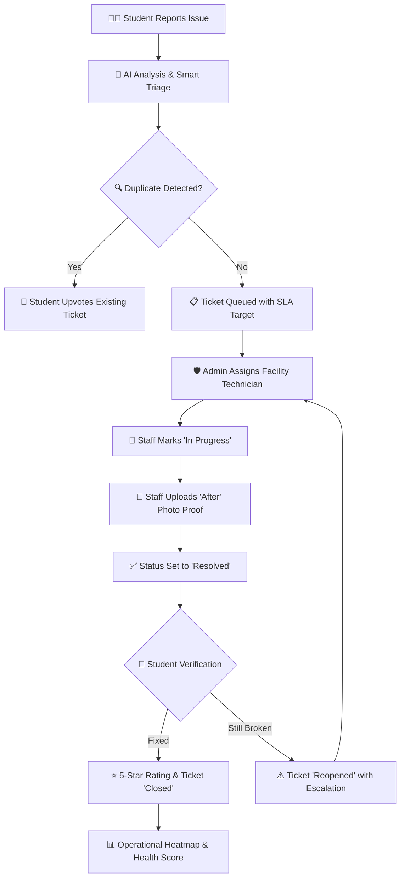
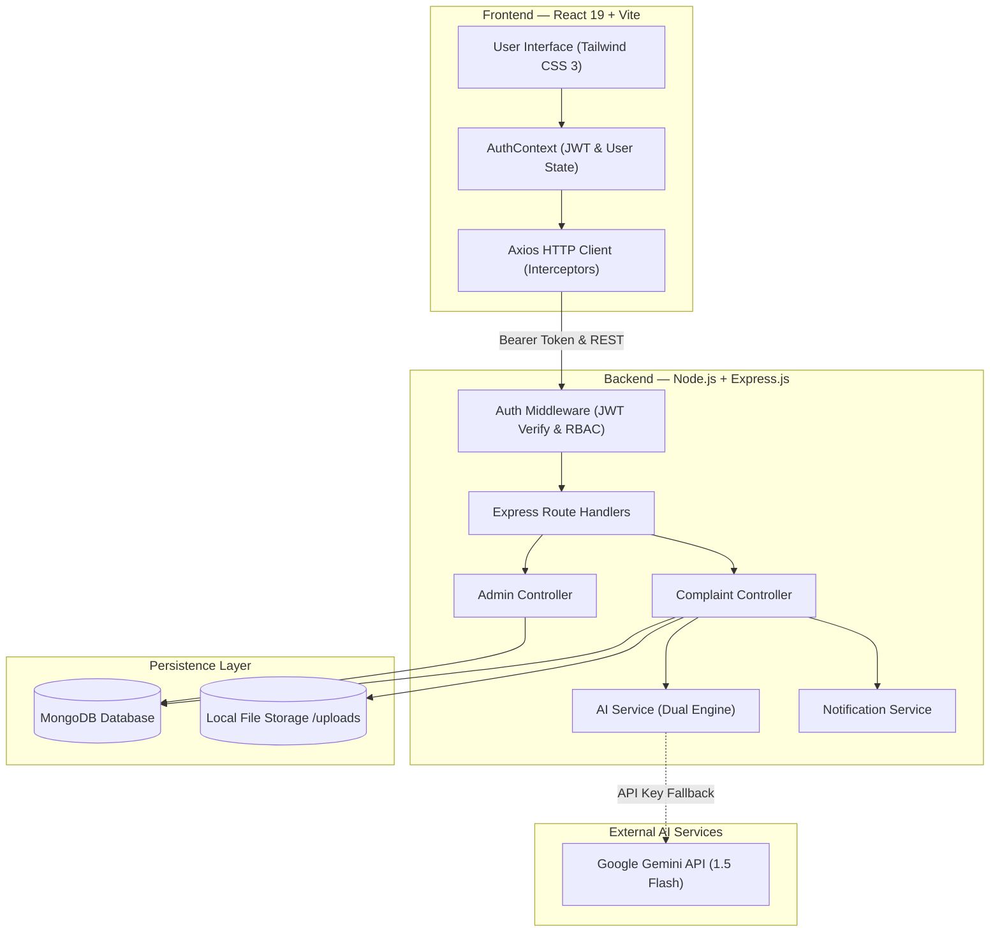

# 🏫 CampusCare

<div align="center">

### **Report. Track. Resolve.**
**A Modern, Full-Stack Campus Maintenance & Operations Intelligence Platform**

[](https://react.dev/)
[](https://vitejs.dev/)
[](https://tailwindcss.com/)
[](https://www.framer.com/motion/)
[](https://nodejs.org/)
[](https://expressjs.com/)
[](https://www.mongodb.com/)
[](https://mongoosejs.com/)
[](https://jwt.io/)
[](https://ai.google.dev/)

<br/>

```
     REPORT
       ↓
   AI ANALYZE
       ↓
     ASSIGN
       ↓
     TRACK
       ↓
    RESOLVE
       ↓
     VERIFY
```

</div>

---

## 📑 Table of Contents

- [Overview](#-overview)
- [Brand Color System](#-brand-color-system)
- [The Problem](#-the-problem)
- [The Solution](#-the-solution)
- [See CampusCare in Action](#-see-campuscare-in-action)
- [Key Features](#-key-features)
- [AI-Powered Intelligence](#-ai-powered-intelligence)
- [User Roles & Permissions](#-user-roles--permissions)
- [Complaint Lifecycle Workflow](#-complaint-lifecycle-workflow)
- [Tech Stack](#-tech-stack)
- [Project Structure](#-project-structure)
- [Directory & File Purpose](#-directory--file-purpose)
- [System Architecture](#-system-architecture)
- [Database Models](#-database-models)
- [REST API Overview](#-rest-api-overview)
- [UI/UX & Design System](#-uiux--design-system)
- [Motion & Interaction](#-motion--interaction)
- [Code Highlights](#-code-highlights)
- [Product Screenshots & Previews](#-product-screenshots--previews)
- [Getting Started](#-getting-started)
- [Environment Variables](#-environment-variables)
- [Testing & Verification](#-testing--verification)
- [Future Roadmap](#-future-roadmap)
- [Why CampusCare](#-why-campuscare)
- [Author & License](#-author--license)

---

## 🌟 Overview

**CampusCare** is a smart campus maintenance and complaint management platform that helps students report campus issues, uses AI to assist with complaint analysis and prioritization, allows maintenance staff to manage resolutions, and gives administrators visibility into campus maintenance operations.

Built to replace fragmented, opaque physical logging systems (paper registers, informal WhatsApp threads, unrecorded calls), CampusCare introduces an accountable end-to-end digital lifecycle:
- **Intelligent Intake:** Fast incident reporting with image attachments and simulated QR quick-fill location presets.
- **Dual-Engine AI Triage:** Automatic classification, department routing, severity scoring, and suggested corrective action.
- **Proactive Deduplication:** Real-time semantic duplicate detection and community upvotes to eliminate redundant tickets.
- **SLA Countdown & Enforcement:** Automated time-to-resolve targets (2h–72h) with dynamic breach warnings.
- **Proof-Backed Resolution:** Interactive Before vs After image comparison slider requiring physical evidence from technicians.
- **Student Verification Loop:** Students independently verify repairs with a one-click Reopen or Close mechanism backed by 1–5 star ratings.
- **Campus Health Intelligence:** SVG zone heatmaps, recurring defect cluster detection, and facility analytics.

CampusCare is engineered with a light, warm, high-contrast visual identity (**Dusty Taupe + Charcoal Brown + Palm Leaf Green**), prioritizing instant readability and accessibility across all screen sizes.

---

## 🎨 Brand Color System

The CampusCare interface and design system follow a natural, high-contrast color palette:

| Color Role | Hex Code | Swatch | Implementation in Platform |
|---|---|---|---|
| **Primary Accent** | `#9F8170` |  `Dusty Taupe` | Primary CTA buttons, active sidebar pills, focus rings, progress bars, interactive sliders |
| **Main Dark Text** | `#3B3C36` |  `Charcoal Brown` | Section titles, card headers, dark sidebar background, main navigation, table headings |
| **Deep Charcoal** | `#292A26` |  `Deep Charcoal` | Page hero titles, high-contrast brand headings, primary table titles |
| **Secondary Accent** | `#8A9A5B` |  `Palm Leaf Green` | AI triage highlights, success status pills, verification badges, verified resolution indicators |
| **Main Background** | `#F7F5F0` |  `Warm Off-White` | Global page body background (80–90% light, breathable UI) |
| **Card Background** | `#FFFFFF` |  `Pure White` | Data cards, tables, modal surfaces, form inputs, dropdown containers |
| **Soft Taupe** | `#F0EBE6` |  `Soft Taupe` | Quick preset chips, filter bars, table headers, demo account selectors |
| **Soft Green** | `#EEF1E7` |  `Soft Green` | AI recommendation card background, verified banners, health score metric widgets |
| **Border Neutral** | `#DEDAD3` |  `Neutral Warm Border` | Subtle card borders, input field borders, table row dividers, timeline guide lines |
| **Muted Secondary** | `#68675F` |  `Secondary Charcoal` | Subtitles, helper text, timestamps, table metadata |
| **Muted Placeholder** | `#77766F` |  `Muted Charcoal` | Input placeholders, inactive icons, breadcrumb separators |

> **Accessibility Note:** No low-contrast or light-on-light text is permitted. All body copy and headings use `#3B3C36` or `#292A26` on white and light backgrounds, exceeding WCAG AA standards.

---

## 🎯 The Problem

Higher education campuses house thousands of students, classrooms, hostels, and laboratories. When physical infrastructure malfunctions, traditional maintenance mechanisms break down:

```
┌──────────────────────────────────────────────┬──────────────────────────────────────────────┐
│            Traditional Reporting             │                 CampusCare                   │
├──────────────────────────────────────────────┼──────────────────────────────────────────────┤
│ ❌ Scattered complaints (WhatsApp, calls)    │ ✓ Centralized reporting single source        │
│ ❌ No clear ownership or technician routing  │ ✓ Structured workflow & role assignment      │
│ ❌ Difficult tracking & lost paperwork       │ ✓ Status tracking with live SLA countdowns   │
│ ❌ Poor visibility into campus-wide hotspots │ ✓ Campus issue heatmap & operations metrics  │
│ ❌ Slow follow-up with no verification       │ ✓ Resolution verification loop with photo    │
└──────────────────────────────────────────────┴──────────────────────────────────────────────┘
```

Supported campus issue categories implemented in the system:
- **Electrical** (faulty switches, tripped breakers, corridor lights, exposed wiring)
- **Plumbing** (leaking pipes, malfunctioning flush valves, tap repairs, overflows)
- **AC / Fan** (HVAC thermostat failures, ceiling fan regulator faults, capacitor burnout)
- **Water Supply** (drinking water cooler failures, overhead tank shortages, pressure drops)
- **Sewage / Drainage** (clogged restroom drains, exterior sewer overflows, foul odors)
- **Cleaning & Hygiene** (stairwell cleanliness, restroom sanitation, garbage overflow)
- **Furniture & Fixtures** (broken desk benches, cracked lecture chairs, damaged doors)
- **Wi-Fi & Internet** (lab router dropouts, access point power failures, cable cut)
- **Security & Safety** (broken door latches, CCTV blindness, faulty emergency lights)
- **Construction & Civil** (wall seepage, ceiling plaster cracks, broken tiles)
- **Garbage & Disposal** (cafeteria bin overflow, laboratory waste collection)

---

## 💡 The Solution

CampusCare unites students, facility managers, and university leadership in a single cohesive feedback loop:

```
[Student Reports Issue]
         ↓
  [AI Analysis & SLA]
         ↓
 [Assignment to Staff]
         ↓
  [Technician Fixes]
         ↓
[Before & After Proof]
         ↓
 [Student Verification]
         ↓
[Feedback & Analytics]
```



---

## 🎥 See CampusCare in Action

CampusCare provides an interactive product experience without external dependencies:

### Product Walkthrough Flow
```
Student Login
      ↓
Student Dashboard
      ↓
Report Issue (with QR Preset)
      ↓
AI Analysis (Category & Priority)
      ↓
Submit Complaint
      ↓
Track Complaint (Live SLA Clock)
      ↓
Maintenance Staff (Accept & Work)
      ↓
Resolution (Upload After Photo)
      ↓
Student Verification (Verify / Reopen)
      ↓
Feedback (1–5 Star Rating)
```

1. **Interactive Demo Tour:** The landing page features a **"Watch Product Tour"** button that opens `ProductDemoModal.jsx`, presenting a 5-step guided simulation of incident triage, duplicate detection, technician dispatch, proof inspection, and admin intelligence.
2. **Instant Demo Accounts:** The login page provides pre-configured single-click demo login buttons for **Admin**, **Maintenance Staff**, and **Student** roles.
3. **Interactive Resolution Proof:** Complaint details dynamically render `BeforeAfterSlider.jsx`, allowing users to drag an interactive divider between pre-repair and post-repair photos.
4. **Live Defect Density Heatmap:** An interactive SVG layout (`CampusHeatmap.jsx`) lets administrators click campus buildings to view live open tickets and risk classifications.

---

## 🚀 Key Features

### 🤖 Smart Defect Reporting with Photo Uploads
Multi-field complaint submission with title, description, category, campus zone, block/wing, floor, room number, image upload (JPG, PNG, WEBP up to 5MB), and optional anonymous reporting mode.

### 🤖 AI Smart Triage Assistant
Contextual AI engine that inspects ticket text in real-time, infers the accurate category, assigns an SLA priority, selects the responsible facility department, and outputs a concise suggested action.

### 🔍 Real-Time Duplicate Issue Detection
Debounced keyword and location matcher that evaluates titles and descriptions as the student types, displaying matching tickets in the same building with similarity scores up to 98%.

### 👥 Community Signal Upvoting
Students can upvote active complaints logged in their building (`X students affected`), elevating ticket urgency without flooding administrators with duplicate tickets.

### 🗺️ Interactive Campus Issue Heatmap
Visual SVG campus blueprint showing real-time defect distribution across academic blocks, library, food court, hostel, sports complex, and admin buildings with dynamic color-coded risk tags.

### ⏱️ Smart Priority & SLA Target Tracking
Automated SLA timeframes calculated at ticket creation:
- **Critical:** 2 hours
- **High:** 8 hours
- **Medium:** 24 hours
- **Low:** 72 hours  
Features live countdown clocks and visual alerts when tickets approach or breach deadlines.

### 📸 Verified Resolution Proof (Before vs After Slider)
Technicians must upload photographic proof of completion. The complaint detail page renders an interactive draggable split-image slider comparing pre-repair evidence against post-repair proof.

### 🔄 Student Resolution Verification Loop
Guarantees closure accountability by putting the final sign-off in the student's hands. Students inspect the proof and choose **"Yes, issue is resolved"** (closes ticket) or **"Still not fixed"** (reopens ticket, escalates priority, and alerts staff).

### ⭐ 5-Star Resolution Satisfaction & Feedback
Post-resolution rating system capturing numerical satisfaction scores (1–5 stars), qualitative feedback, and staff behavior assessment, driving campus health metrics.

### 💬 Ticket Activity Thread & Internal Comments
Chronological audit trail recording all status transitions, technician assignments, timestamped actions, and comments between students, staff, and administrators.

### 📊 Operations Intelligence & Campus Health Score
Dynamic 0–100 health index computed from open ticket load, resolution velocity, SLA compliance rate, and student feedback, paired with category and priority breakdown charts via Recharts.

### ⚠️ Recurring Defect Cluster Detection
Identifies repeated failures at identical campus coordinates (e.g., repeated plumbing leaks in Hostel Block A) and surfaces preventive maintenance recommendations.

### ⌨️ Global Command Palette (`Ctrl+K` / `Cmd+K`)
System-wide quick search modal allowing keyboard navigation across routes, quick ticket lookups, and direct access to administrative tools.

### 🔔 In-App Notification Center
Real-time notification system logging assignment alerts, status advancements, comment additions, and reopen events with unread tracking and instant mark-as-read options.

---

## 🤖 AI-Powered Intelligence

CampusCare features a **Dual-Engine Architecture** for intelligent defect analysis, combining cloud AI reasoning with a zero-dependency local rule heuristic:

```
[Complaint Title & Description]
              │
      [AI Analysis Call]
              │
     ┌────────┴────────┐
     ▼                 ▼
[Google Gemini]    [Rule Engine]
 (Cloud API)        (Local Heuristic)
     │                 │
     └──► Fallback ────┘
              │
              ▼
   [Structured JSON Output]
   • Category
   • Priority (Low-Critical)
   • Department
   • Suggested Action
   • Reason & Confidence
```

### Visual Identity
This section uses **Palm Leaf Green (`#8A9A5B`)** as its visual accent, paired with **Soft Green (`#EEF1E7`)** card backgrounds.

### How the Dual-Engine Operates
1. **Cloud Intelligence (Google Gemini 1.5 Flash):**
   - When `AI_API_KEY` is configured, the server prompts `gemini-1.5-flash-latest` using strict JSON schema output and low temperature (`0.3`).
   - The model analyzes technical severity, safety hazards, and department mapping.
2. **Deterministic Fallback Engine (Zero-Config Offline Default):**
   - If the API key is not provided, or if network timeouts / rate limits occur, the system seamlessly falls back to `analyzeWithRules()`.
   - The rule engine scores keywords across 11 defect categories and executes safety boost rules (`fire`, `spark`, `shock`, `flood`, `gas` $\rightarrow$ automatically elevated to `Critical`).
   - Returns a structured response with 80%+ confidence, ensuring 100% uptime with zero external service dependencies.

---

## 👥 User Roles & Permissions

The platform enforces Role-Based Access Control (RBAC) across frontend routes and backend Express middleware (`middleware/auth.js`):

| Role | Accessible Views | Permitted Actions |
|---|---|---|
| **👨‍🎓 Student** | • Student Dashboard<br/>• Report Issue<br/>• My Complaints<br/>• Complaint Details<br/>• Notifications<br/>• Profile | • Submit defect tickets with images & location presets<br/>• Upvote active community complaints<br/>• Track live status & SLA countdowns<br/>• Post comments & questions on tickets<br/>• **Verify resolution** or **Reopen** if still broken<br/>• Submit 1–5 star rating & qualitative feedback |
| **🧰 Maintenance Staff** | • Staff Dashboard<br/>• Assigned Work Queue<br/>• Complaint Details<br/>• Notifications<br/>• Profile | • View assigned work orders filtered by status & priority<br/>• Transition ticket status (`In Progress`, `Resolved`)<br/>• Upload completion photo for Before/After proof<br/>• Log technical resolution notes & parts replaced<br/>• Post comments to communicate with reporters |
| **🛡️ Administrator** | • Operations Dashboard<br/>• All Complaints Queue<br/>• Operations Analytics<br/>• Campus Heatmap<br/>• User Management<br/>• Notifications<br/>• Profile | • Full CRUD on all campus complaints<br/>• Assign/reassign tickets to maintenance technicians<br/>• Override priority, category, SLA, and status<br/>• Access operational intelligence & Campus Health Score<br/>• View recurring defect clusters & preventive insights<br/>• Manage user accounts, role elevations, and activations |

---

## 🔄 Complaint Lifecycle Workflow

Every complaint moves through a state machine stored in MongoDB with timestamped audit entries in `statusHistory`:

```
         ┌───────────────┐
         │   Submitted   │
         └───────┬───────┘
                 │ (AI Triage Analyzed)
                 ▼
         ┌───────────────┐
         │  AI Analyzed  │
         └───────┬───────┘
                 │ (Supervisor Review)
                 ▼
         ┌───────────────┐
         │ Under Review  │
         └───────┬───────┘
                 │ (Staff Assigned)
                 ▼
         ┌───────────────┐
         │   Assigned    │
         └───────┬───────┘
                 │ (Work Commenced)
                 ▼
         ┌───────────────┐
         │  In Progress  │ ◄─────────────────────────┐
         └───────┬───────┘                           │
                 │ (After Proof Uploaded)            │
                 ▼                                   │
         ┌───────────────┐                           │ (Student Reopens)
         │   Resolved    │                           │
         └───────┬───────┘                           │
                 │                                   │
                 ├───────────────────────────────────┤
                 ▼                                   ▼
         ┌───────────────┐                   ┌───────────────┐
         │   Verified    │                   │   Reopened    │
         └───────┬───────┘                   └───────────────┘
                 │ (Student Closes)
                 ▼
         ┌───────────────┐
         │    Closed     │
         └───────────────┘

* Note: If SLA expires while unresolved, status triggers [ Escalated ] with administrator alert.
```

### Reopen Loop Detail
```
RESOLVED  ──►  REOPENED  ──►  IN PROGRESS  ──►  RESOLVED
```
When a student rejects a repair, status flips to `Reopened`, priority escalates by one tier, an escalation event is appended to `statusHistory`, and an urgent notification is dispatched to maintenance supervisors.

---

## 🛠️ Tech Stack

### Frontend
- **Framework:** [React 19](https://react.dev/) + [Vite 8](https://vitejs.dev/)
- **Styling:** [Tailwind CSS 3](https://tailwindcss.com/) with custom CampusCare brand tokens
- **Animations:** [Framer Motion 13](https://www.framer.com/motion/)
- **Routing:** [React Router 7](https://reactrouter.com/) (protected role guards)
- **Data Visualization:** [Recharts 3](https://recharts.org/)
- **Icons:** [Lucide React](https://lucide.dev/)
- **HTTP Client:** [Axios](https://axios-http.com/) with bearer token interceptors
- **Toasts:** [React Hot Toast](https://react-hot-toast.com/)

### Backend
- **Runtime:** [Node.js](https://nodejs.org/) (v18+)
- **Framework:** [Express.js 4](https://expressjs.com/)
- **Database:** [MongoDB](https://www.mongodb.com/) via [Mongoose 8](https://mongoosejs.com/) ODM
- **Authentication:** [JSON Web Tokens (JWT)](https://jwt.io/) + [bcryptjs](https://github.com/dcodeIO/bcrypt.js)
- **File Upload:** [Multer](https://github.com/expressjs/multer) (disk storage with image MIME filtering)
- **Input Validation:** [express-validator](https://express-validator.github.io/)
- **AI Integration:** Google Generative AI API (`gemini-1.5-flash-latest`) + Local Rule Heuristic

---

## 📂 Project Structure

```text
CampusCare/
├── client/                               # Frontend Single Page Application (React 19 + Vite)
│   ├── public/                           # Static assets (favicons, SVGs)
│   ├── src/
│   │   ├── components/                   # Reusable UI & presentation components
│   │   │   ├── ui/                       # Core UI primitives
│   │   │   │   ├── BeforeAfterSlider.jsx # Interactive proof comparison slider
│   │   │   │   ├── CampusHealthScoreCard.jsx # Composite 0-100 gauge widget
│   │   │   │   ├── CampusHeatmap.jsx     # SVG campus zone defect heatmap
│   │   │   │   ├── CommandPalette.jsx    # Global Ctrl+K keyboard palette
│   │   │   │   ├── DuplicateDetectionCard.jsx # Live duplicate warning banner
│   │   │   │   └── index.jsx             # Loaders, Badges, ConfirmDialog, StatCard
│   │   │   ├── CampusGridAnimation.jsx   # Ambient canvas background animation
│   │   │   ├── ComplaintCard.jsx         # Universal complaint card with SLA badge
│   │   │   └── ProductDemoModal.jsx      # 5-step interactive product tour modal
│   │   ├── context/                      # React Context providers
│   │   │   └── AuthContext.jsx           # Global user state, login/logout, tokens
│   │   ├── layouts/                      # Layout wrappers
│   │   │   └── DashboardLayout.jsx       # Charcoal Brown sidebar & topbar layout
│   │   ├── pages/                        # Application views (11 routes)
│   │   │   ├── AnalyticsPage.jsx         # Operations intelligence & clusters
│   │   │   ├── ComplaintDetailPage.jsx   # Ticket lifecycle, proof, comments, verify
│   │   │   ├── ComplaintsPage.jsx        # Search, filter, pagination grid
│   │   │   ├── CreateComplaintPage.jsx   # Ticket submission & AI triage
│   │   │   ├── DashboardPage.jsx         # Role-tailored dashboards
│   │   │   ├── LandingPage.jsx           # Public hero, interactive showcase, footer
│   │   │   ├── LoginPage.jsx             # Authentication & demo account buttons
│   │   │   ├── NotificationsPage.jsx     # Activity feed & unread center
│   │   │   ├── ProfilePage.jsx           # Account management & credentials
│   │   │   ├── RegisterPage.jsx          # New user registration
│   │   │   └── UsersPage.jsx             # Admin user operations & role editor
│   │   ├── services/                     # Backend API integration services
│   │   │   ├── adminService.js           # Analytics & user management APIs
│   │   │   ├── api.js                    # Base Axios instance with auth interceptor
│   │   │   ├── authService.js            # Login, register, profile endpoints
│   │   │   ├── complaintService.js       # CRUD, triage, duplicate, upvote APIs
│   │   │   ├── index.js                  # Barrel service export
│   │   │   └── notificationService.js    # Notification read/delete APIs
│   │   ├── utils/                        # Frontend helpers & data maps
│   │   │   └── helpers.js                # Priority colors, status badges, dates
│   │   ├── App.jsx                       # Route tree & role protection guards
│   │   ├── index.css                     # Design tokens, typography, component CSS
│   │   └── main.jsx                      # React bootstrap entry
│   ├── package.json
│   ├── tailwind.config.js                # CampusCare brand palette configuration
│   └── vite.config.js                    # Vite server configuration & proxies
│
├── server/                               # Backend REST API Service (Node.js + Express)
│   ├── controllers/                      # Business & route handling logic
│   │   ├── adminController.js            # Analytics, clusters, health score, users
│   │   ├── authController.js             # Auth token issuance & profile logic
│   │   ├── complaintController.js        # Ticket lifecycle, duplicate check, SLA
│   │   └── notificationController.js     # User notification queries & marks
│   ├── middleware/                       # Request processing middlewares
│   │   ├── auth.js                       # JWT verification & role authorization
│   │   ├── errorHandler.js               # Centralized API error response handler
│   │   └── upload.js                     # Multer disk upload config & limits
│   ├── models/                           # Mongoose data schemas
│   │   ├── Complaint.js                  # Ticket model with SLA & status history
│   │   ├── Feedback.js                   # 5-star rating & review model
│   │   ├── Notification.js               # In-app notification alert model
│   │   └── User.js                       # User credentials, roles & departments
│   ├── routes/                           # API Route declarations
│   │   ├── admin.js                      # Admin operations router
│   │   ├── auth.js                       # Authentication router
│   │   ├── complaints.js                 # Complaints router
│   │   └── notifications.js              # Notifications router
│   ├── services/                         # Business logic services
│   │   ├── aiService.js                  # Dual-engine AI analysis & Gemini bridge
│   │   └── notificationService.js        # Internal notification generator
│   ├── uploads/                          # Image storage for defect & proof photos
│   ├── utils/                            # Database utilities
│   │   └── seed.js                       # Demo database seeder script
│   ├── package.json
│   └── server.js                         # Express application entry & MongoDB init
│
├── .env.example                          # Environment variable configuration template
└── README.md                             # Comprehensive project documentation
```

---

## 📁 Directory & File Purpose

| Path | Purpose & Responsibilities |
|---|---|
| `client/src/App.jsx` | Application route tree configuring `ProtectedRoute` and `RoleRoute` guards. |
| `client/src/layouts/DashboardLayout.jsx` | Dashboard shell with Charcoal Brown `#3B3C36` navigation sidebar, global search trigger, and active tab highlights. |
| `client/src/components/ui/CampusHeatmap.jsx` | Interactive SVG blueprint calculating defect counts, critical flags, and risk badges per campus building. |
| `client/src/components/ui/BeforeAfterSlider.jsx` | Draggable comparison slider element rendering physical repair proof. |
| `client/src/components/ui/CommandPalette.jsx` | Global keyboard-driven modal listening to `Cmd+K`/`Ctrl+K` with live ticket query filtering. |
| `client/src/components/ui/DuplicateDetectionCard.jsx` | Real-time warning card presenting matching issues and allowing immediate community upvoting. |
| `client/src/pages/CreateComplaintPage.jsx` | Defect ticket entry with simulated QR presets, duplicate detector, and contextual AI analysis. |
| `client/src/pages/ComplaintDetailPage.jsx` | Ticket timeline, technician controls, comments thread, Before/After proof, and student verification loop. |
| `server/server.js` | Express entry point, connects to MongoDB, mounts static `/uploads` route, registers API routes, and configures error handling. |
| `server/services/aiService.js` | Dual-engine triage logic (Gemini API bridge + local rule-based category/priority heuristic). |
| `server/middleware/auth.js` | Validates Bearer JWT tokens in request headers and enforces role permissions (`authorize('admin')`). |
| `server/controllers/complaintController.js` | Manages ticket creation, duplicate keyword computation, upvote toggling, SLA calculation, and status progression. |
| `server/controllers/adminController.js` | Aggregates campus metrics, computes the Campus Health Score (0–100), and detects recurring defect clusters. |
| `server/utils/seed.js` | Database initialization script creating default demo accounts (`admin`, `staff`, `student`) and sample campus complaints. |

---

## 🏗️ System Architecture



---

## 🗄️ Database Models

### 1. `Complaint`
The primary ticket entity tracking lifecycle, SLA metrics, locations, and multimedia proof:
```javascript
{
  title: String,               // 5–200 characters, required
  description: String,         // 10–2000 characters, required
  category: String,            // Enum: Electrical, Plumbing, Water Supply, Sewage / Drainage, Cleaning,
                               //       Furniture, Wi-Fi / Internet, AC / Fan, Security, Construction, Garbage, Other
  priority: String,            // Enum: 'Low', 'Medium', 'High', 'Critical' (default: 'Medium')
  status: String,              // Enum: 'Submitted', 'AI Analyzed', 'Under Review', 'Assigned', 
                               //       'In Progress', 'Resolved', 'Verification', 'Closed', 'Reopened', 'Escalated'
  location: String,            // Enum: 'Block 1', 'Block 2', 'Block 3', 'Block 4', 'Library', 'Food Court', 
                               //       'Hostel', 'Parking', 'Sports Complex', 'Administrative Block'
  block: String,               // Wing/sub-block details
  roomArea: String,            // Specific room/lab number
  floor: String,               // Floor level
  image: String,               // Initial defect photo URL
  beforeImage: String,         // Pre-repair photo URL
  afterImage: String,          // Post-repair photo uploaded by technician
  reporter: ObjectId -> User,  // Student reporter reference
  isAnonymous: Boolean,        // Masks reporter name to technicians
  assignedTo: ObjectId -> User,// Assigned staff technician reference
  department: String,          // Routed facility department
  aiAnalysis: {
    category: String,
    priority: String,
    department: String,
    suggestedAction: String,
    reason: String,
    confidence: Number,
    analyzedAt: Date
  },
  sla: {
    targetHours: Number,       // 2h, 8h, 24h, 72h
    deadline: Date,
    isBreached: Boolean,
    escalatedAt: Date
  },
  verification: {
    status: String,            // 'Pending', 'Verified', 'Rejected'
    notes: String,
    verifiedAt: Date
  },
  upvotes: [ObjectId -> User], // Supporting students
  upvoteCount: Number,
  comments: [{ user: ObjectId, text: String, isInternal: Boolean, createdAt: Date }],
  statusHistory: [{ status: String, changedBy: ObjectId, note: String, timestamp: Date }],
  feedback: ObjectId -> Feedback
}
```

### 2. `User`
Manages identities, role assignments, and departmental associations:
```javascript
{
  name: String,                               // Required, 2–100 chars
  email: { type: String, unique: true },      // Required, lowercase, validated
  password: { type: String, select: false },  // Bcrypt hashed
  role: { 
    type: String, 
    enum: ['student', 'staff', 'admin'], 
    default: 'student' 
  },
  department: String,                         // Facility department or major
  studentId: String,                          // Campus student identification
  phone: String,
  avatar: String,
  isActive: { type: Boolean, default: true },
  lastLogin: Date
}
```

### 3. `Feedback`
Captures post-resolution student satisfaction ratings:
```javascript
{
  complaint: ObjectId -> Complaint,           // Unique per complaint
  user: ObjectId -> User,
  rating: { type: Number, min: 1, max: 5 },   // 1–5 star rating
  comment: String,                            // Optional review text (max 500 chars)
  isHelpful: Boolean,
  responseTime: Number,                       // Calculated turnaround days
  staffBehavior: { type: Number, min: 1, max: 5 }
}
```

### 4. `Notification`
Stores user-specific activity notifications:
```javascript
{
  user: ObjectId -> User,
  title: String,
  message: String,
  type: {
    type: String,
    enum: ['complaint_submitted', 'complaint_assigned', 'status_changed', 
           'complaint_resolved', 'complaint_reopened', 'new_comment', 'high_priority', 'general'],
    default: 'general'
  },
  complaint: ObjectId -> Complaint,
  read: { type: Boolean, default: false },
  readAt: Date
}
```

---

## 📡 REST API Overview

### Authentication Endpoints (`/api/auth`)
| Method | Endpoint | Access | Description |
|---|---|---|---|
| `POST` | `/api/auth/register` | Public | Register a new user (`student`, `staff`, `admin`) |
| `POST` | `/api/auth/login` | Public | Authenticate with email/password & receive JWT |
| `GET` | `/api/auth/me` | Authenticated | Retrieve current user profile |
| `PUT` | `/api/auth/profile` | Authenticated | Update user name, phone, department |

### Complaint Endpoints (`/api/complaints`)
| Method | Endpoint | Access | Description |
|---|---|---|---|
| `GET` | `/api/complaints` | Authenticated | Query complaints with role filters, pagination, search |
| `POST` | `/api/complaints` | Student, Admin | Submit a new ticket with optional photo attachment |
| `POST` | `/api/complaints/check-duplicates` | Authenticated | Real-time duplicate defect detector |
| `POST` | `/api/complaints/analyze` | Authenticated | Execute AI analysis on title & description |
| `GET` | `/api/complaints/:id` | Authenticated | Get complete ticket details with history & comments |
| `PUT` | `/api/complaints/:id` | Authenticated | Update ticket status, assignment, or upload resolution proof |
| `DELETE` | `/api/complaints/:id` | Admin, Reporter | Delete a complaint ticket |
| `POST` | `/api/complaints/:id/upvote` | Authenticated | Toggle community upvote signal on active ticket |
| `POST` | `/api/complaints/:id/verify` | Student, Admin | Student resolution verification loop (Verify / Reject) |
| `POST` | `/api/complaints/:id/comments` | Authenticated | Append an update or comment to the ticket thread |
| `POST` | `/api/complaints/:id/feedback` | Student | Submit 1–5 star rating & feedback review |

### Admin & Operations Endpoints (`/api/admin`)
| Method | Endpoint | Access | Description |
|---|---|---|---|
| `GET` | `/api/admin/analytics` | Admin | Aggregate operations metrics, health score, clusters |
| `GET` | `/api/admin/users` | Admin | Retrieve paginated user list with role filtering |
| `PUT` | `/api/admin/users/:id` | Admin | Update user role or toggle account active status |
| `GET` | `/api/admin/staff` | Admin | Retrieve list of maintenance staff technicians |

### Notification Endpoints (`/api/notifications`)
| Method | Endpoint | Access | Description |
|---|---|---|---|
| `GET` | `/api/notifications` | Authenticated | Fetch notifications for logged-in user |
| `PUT` | `/api/notifications/read-all` | Authenticated | Mark all notifications as read |
| `PUT` | `/api/notifications/:id/read` | Authenticated | Mark a single notification as read |
| `DELETE` | `/api/notifications/:id` | Authenticated | Delete a notification item |

---

## 🎨 UI/UX & Design System

CampusCare rejects generic dark templates in favor of a **light, natural, high-contrast visual identity**:

- **80–90% Light Backgrounds:** Base background `#F7F5F0` paired with pure white cards `#FFFFFF` and warm borders `#DEDAD3`.
- **10–20% High-Contrast Anchors:** Deep Charcoal Brown `#3B3C36` is reserved for the sidebar navigation, footer, and section headers.
- **Dusty Taupe Accent (`#9F8170`):** Used purposefully for primary action buttons, active navigation indicators, and keyboard focus rings.
- **Palm Leaf Green Accent (`#8A9A5B`):** Denotes AI insights, positive indicators, and completed resolutions.
- **Typography:**
  - **Headings:** `Space Grotesk` & `Plus Jakarta Sans` with bold weights and tight tracking.
  - **Body:** `Plus Jakarta Sans` set to `#4A4943` / `#3B3C36` for comfortable reading.
  - **Metadata & Codes:** `JetBrains Mono` for IDs, timestamps, coordinates, and SLA metrics.

---

## ⚡ Motion & Interaction

Powered by **Framer Motion 13**:
- **Smooth View Transitions:** Subtle opacity and y-axis shifts (`opacity: 0, y: 15`) on page navigation.
- **Ambient Campus Grid:** A custom HTML5 Canvas element (`CampusGridAnimation.jsx`) rendering subtle, interactive pulsing nodes that respond to cursor movement.
- **Card Hover Physics:** Delicate elevation on complaint cards (`transform: translateY(-2px)`) with warm taupe glow highlights.
- **Before/After Split Drag:** Smooth mouse and touch drag tracking with constraint clamping for visual repair proof inspection.
- **Multi-Step AI Progression:** Animated step-by-step scanner indicator reflecting triage stages in real time.

---

## 💻 Code Highlights

### 1. Resilient Dual-Engine AI Triage (`server/services/aiService.js`)
```javascript
// Automatically falls back to deterministic rule engine if Gemini is unavailable
const analyzeComplaint = async (title, description) => {
  const text = `${title} ${description}`.trim();
  
  // Try Gemini AI if API key is provided
  if (process.env.AI_API_KEY && process.env.AI_API_KEY !== 'your_google_gemini_api_key_here') {
    try {
      return await analyzeWithGemini(title, description);
    } catch (err) {
      console.warn('Gemini API call failed, falling back to rule-based engine:', err.message);
    }
  }

  // Deterministic local keyword & safety rule engine
  return analyzeWithRules(text);
};
```

### 2. Automated SLA Target Calculation (`server/controllers/complaintController.js`)
```javascript
// Dynamic SLA calculation based on severity tier
const getSlaHours = (priority) => {
  switch (priority) {
    case 'Critical': return 2;   // 2 hours
    case 'High':     return 8;   // 8 hours
    case 'Medium':   return 24;  // 24 hours
    case 'Low':      return 72;  // 72 hours
    default:         return 24;
  }
};

const slaHours = getSlaHours(priority);
const deadline = new Date(Date.now() + slaHours * 60 * 60 * 1000);
```

### 3. Interactive Before/After Proof Slider (`client/src/components/ui/BeforeAfterSlider.jsx`)
```jsx
// Draggable comparison slider with boundary clamping
const handleMove = (clientX) => {
  if (!containerRef.current) return;
  const rect = containerRef.current.getBoundingClientRect();
  const x = clientX - rect.left;
  const percentage = Math.max(0, Math.min(100, (x / rect.width) * 100));
  setSliderPos(percentage);
};
```

---

## 📸 Product Screenshots & Previews

The platform contains integrated visual assets and interactive preview components:

| Feature View | Component / Asset | Description |
|---|---|---|
| **Public Hero & Triage** | `LandingPage.jsx` | Public landing page featuring interactive lifecycle tabs, real-time AI triage simulation, and demo modal trigger. |
| **Interactive Proof Slider** | `BeforeAfterSlider.jsx` | Technician proof inspection element with interactive draggable divider comparing pre-repair against post-repair evidence. |
| **Before Repair Photo** | `server/uploads/washroom_tap_before.svg` | Physical proof artifact demonstrating leaking tap fixture before technician dispatch. |
| **After Repair Photo** | `server/uploads/washroom_tap_after.svg` | Verified completion artifact showing repaired and replaced chrome fixture. |
| **Defect Heatmap** | `CampusHeatmap.jsx` | SVG blueprint mapping 10 campus buildings with color-coded incident density and risk levels. |
| **Health Score Widget** | `CampusHealthScoreCard.jsx` | Composite 0–100 gauge reflecting campus maintenance health and SLA adherence. |

---

## 🚀 Getting Started

### Prerequisites
- **Node.js:** v18.0.0 or higher
- **MongoDB:** Locally running instance on port `27017` or a MongoDB Atlas URI
- **Package Manager:** `npm` (v8+)

---

### Step 1: Clone the Repository
```bash
git clone https://github.com/your-username/CampusCare.git
cd CampusCare
```

---

### Step 2: Configure Environment Variables
Create a `.env` file in the `server/` directory:
```bash
cp .env.example server/.env
```

---

### Step 3: Install Dependencies
```bash
# Install backend dependencies
cd server
npm install

# Install frontend dependencies
cd ../client
npm install
```

---

### Step 4: Seed Demo Data
Initialize the database with default campus accounts, realistic complaints, and historical resolution data:
```bash
cd ../server
npm run seed
```

Default seeded demo credentials:
| Role | Email | Password |
|---|---|---|
| **Admin** | `admin@campuscare.edu` | `Admin@123` |
| **Maintenance Staff** | `staff1@campuscare.edu` | `Staff@123` |
| **Student** | `student1@campuscare.edu` | `Student@123` |

---

### Step 5: Run the Application

**Terminal 1 (Backend Server):**
```bash
cd server
npm run dev
# Server running on http://localhost:5000
```

**Terminal 2 (Frontend Client):**
```bash
cd client
npm run dev
# Frontend running on http://localhost:5173
```

Navigate to **`http://localhost:5173`** in your browser.

---

## 🔐 Environment Variables

Configuration settings located in `server/.env`:

```env
# Server Configuration
PORT=5000
NODE_ENV=development

# MongoDB Connection String
MONGODB_URI=mongodb://localhost:27017/campuscare

# JWT Authentication Secret & Token Expiry
JWT_SECRET=your_super_secret_jwt_key_here_change_in_production
JWT_EXPIRE=30d

# AI Configuration (Optional - Defaults to local rule engine if not provided)
AI_PROVIDER=gemini
AI_API_KEY=your_google_gemini_api_key_here
```

---

## 🧪 Testing & Verification

### Production Build Validation
Verify that the frontend builds cleanly without errors:
```bash
cd client
npm run build
```
*Result:* Builds in ~21 seconds, outputting optimized chunks with zero JSX or syntax errors.

### Manual Verification Checklist
- [x] **Authentication:** Login via demo accounts (`student`, `staff`, `admin`) with session persistence in `localStorage`.
- [x] **Complaint Creation:** Submit a new ticket with image attachment; verify auto-assignment to department.
- [x] **AI Triage:** Test description input and observe automated category/priority selection.
- [x] **Duplicate Detection:** Enter "Water leakage in restroom" and verify matching card trigger.
- [x] **Resolution Proof:** Maintenance staff uploads After photo; verify Before/After slider interactivity.
- [x] **Verification Loop:** Student clicks "Yes, issue is resolved" to close ticket, or "Still not fixed" to reopen.
- [x] **Admin Analytics:** Verify Health Score gauge, category charts, and recurring cluster cards.

---

## 🗺️ Future Roadmap

- [ ] **Push Notifications:** Native Web Push notifications via Service Workers for real-time ticket progress updates.
- [ ] **Mobile App:** Cross-platform React Native / Expo mobile application for students and field technicians.
- [ ] **Physical QR Labels:** Generator for durable, physical QR stickers deployed to every classroom, desk, and restroom.
- [ ] **IoT Sensor Ingestion:** Webhook integration for smart water tank sensors and power trip detectors.
- [ ] **Multi-Campus Support:** Tenant isolation and custom facility hierarchy for multi-campus university systems.

---

## 💡 Why CampusCare

1. **Production Mindset:** Designed as a portfolio-caliber platform, featuring complete error boundaries, SLA timers, fallback AI engines, and responsive layouts.
2. **Real Operational Impact:** Solves the exact frustration experienced across academic campuses—lost complaints, unaccountable staff, and lack of proof.
3. **Accessibility First:** Replaces low-contrast design tropes with a high-contrast palette (`#3B3C36` text on `#F7F5F0` / `#FFFFFF` backgrounds) meeting standard readability criteria.
4. **Architectural Resilience:** Zero external service dependency required for core functionality; works reliably offline via built-in rule engines.

---

## 👤 Author & License

**CampusCare Team**  
*Full-Stack Campus Maintenance & Operations Intelligence Platform*

- **GitHub:** [@your-username](https://github.com/your-username)
- **LinkedIn:** [Your Profile](https://linkedin.com/in/your-profile)
- **Email:** `contact@campuscare.edu`

Distributed under the **MIT License**. See `LICENSE` for details.

<br/>

<div align="center">

**CampusCare — Report. Track. Resolve.**  
*Designed and engineered for accountable, high-performance campus operations.*

</div>
